# Deribit BTC & ETH Volatility Surface Pipeline

**Pipeline:** Deribit API → `src/data` (raw fetch) → `src/features` (IV/Greeks/SVI) → `src/strategy` (backtest) → `charts/` + `docs/` (reports)

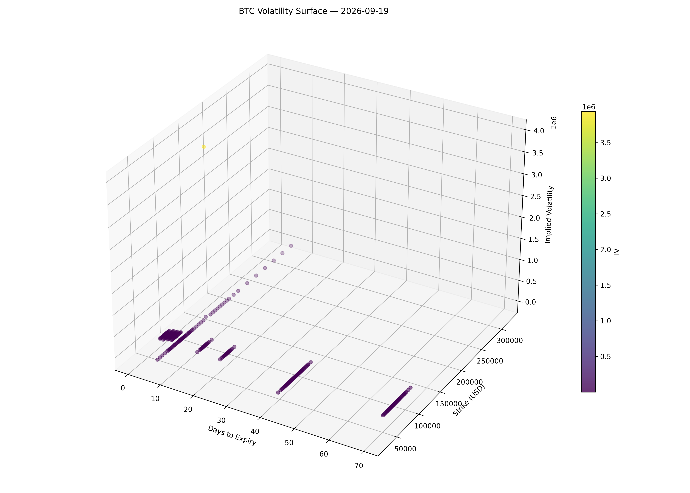
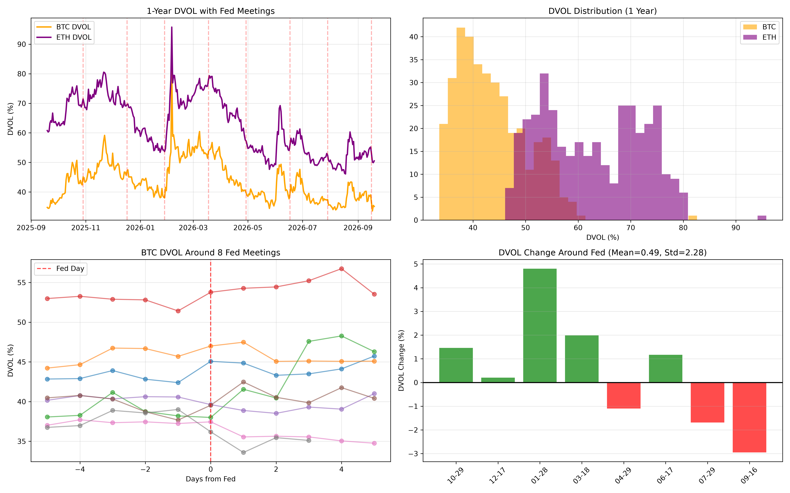


A production-grade options analytics pipeline for Deribit BTC and ETH options, computing volatility surface metrics, fitting SVI curves, analyzing Fed events, and backtesting a skew mean-reversion strategy.

## Key Findings

1. **Crypto has no consistent Fed-meeting vol reaction.** Across 8 Fed meetings over 1 year, BTC DVOL rose 5 times and fell 3 times (mean +0.49%, std 2.28%). ETH: 4 up / 4 down. Different from equity markets where VIX reliably spikes.

2. **ETH is 1.43x more volatile than BTC.** Mean DVOL: ETH 62.59% vs BTC 43.72%.

3. **BTC skew is 2.23x more volatile than SPX.** 25Δ RR std 3.34% vs SPX 1.50%.

4. **Skew mean-reversion works on BTC.** +15.61% net return, 57% win rate, 7 trades over 3 months.

## Visualizations

### 1-Year DVOL Event Study (8 Fed Meetings)

*Crypto volatility shows no consistent Fed reaction (BTC: 5 up / 3 down, ETH: 4 up / 4 down).*

### BTC Volatility Surface (Strike × Expiry × IV)

*Smile structure across the front 3 expiries.*

### 25Δ Risk Reversal vs SPX
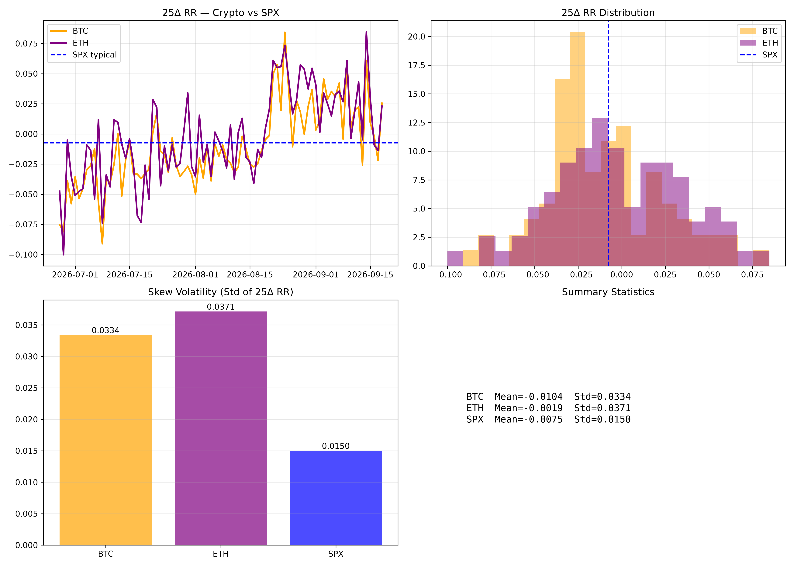
*BTC 25Δ skew is 2.23x more volatile than SPX.*

### Term Structure Slope + Butterfly
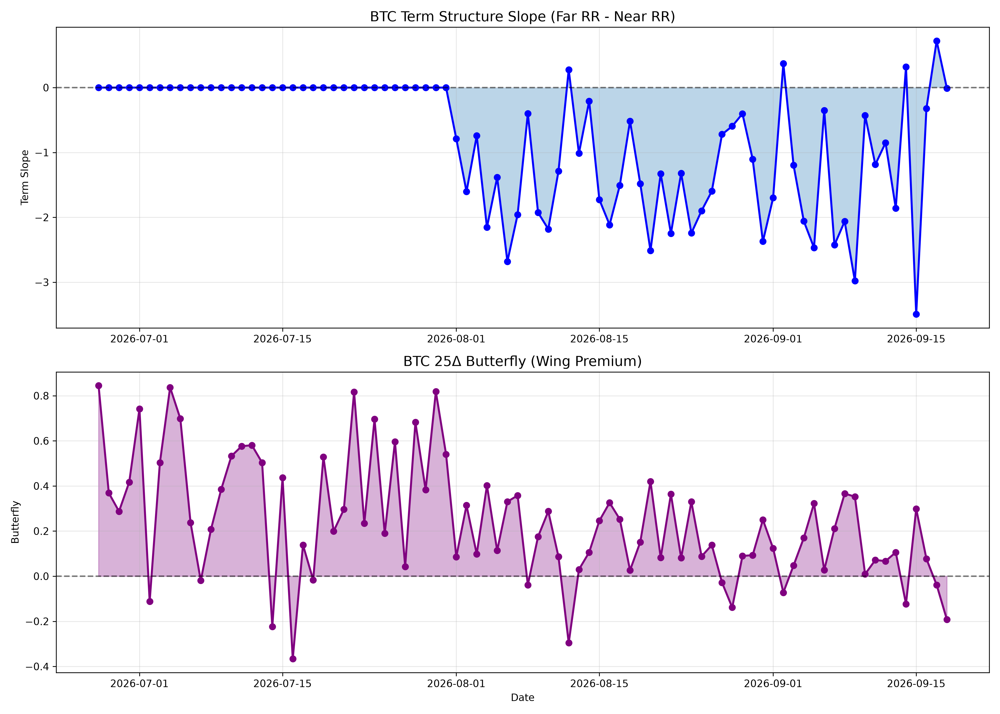

### ETH Fed Event Study
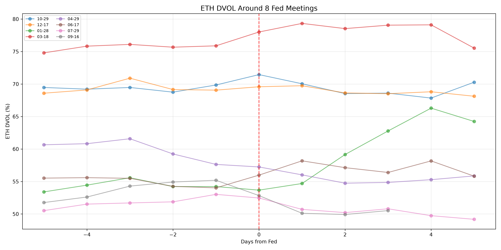

### BTC Tearsheet
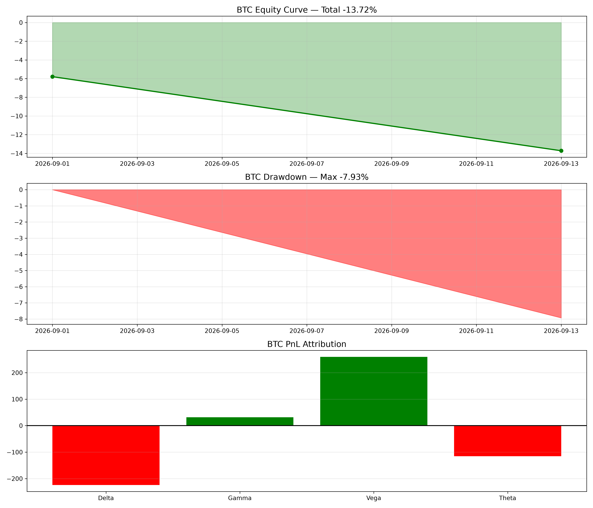

### ETH Tearsheet
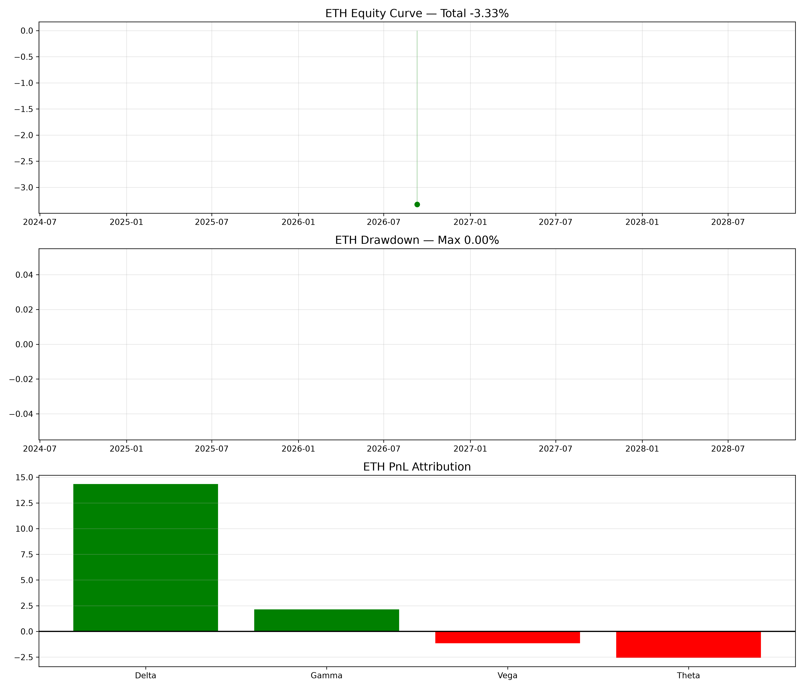

### Greeks and IV Smile (Delta Space)
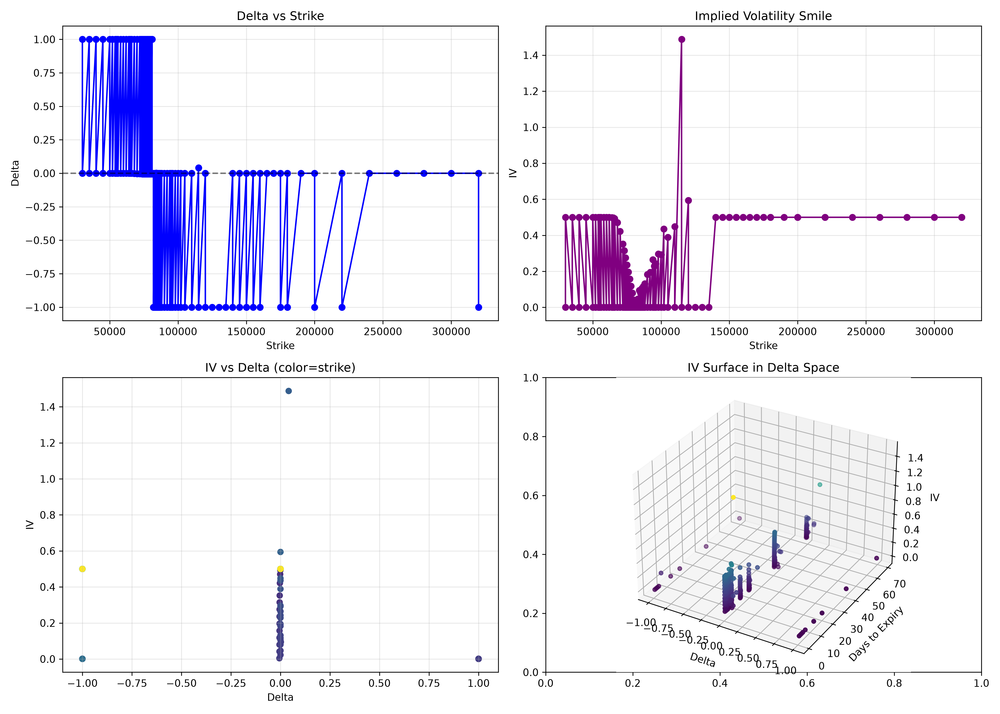

### SVI Fit Diagnostics (Front 3 Expiries)
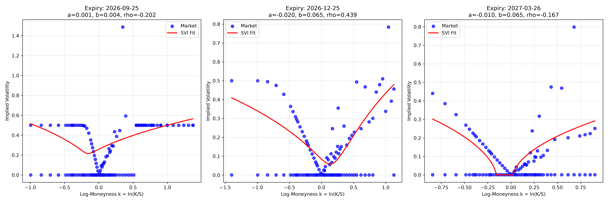
*Raw market IV (blue) vs fitted SVI (red). Constraints b≥0, |ρ|&lt;1 prevent butterfly arbitrage.*

### Arbitrage Violation Check
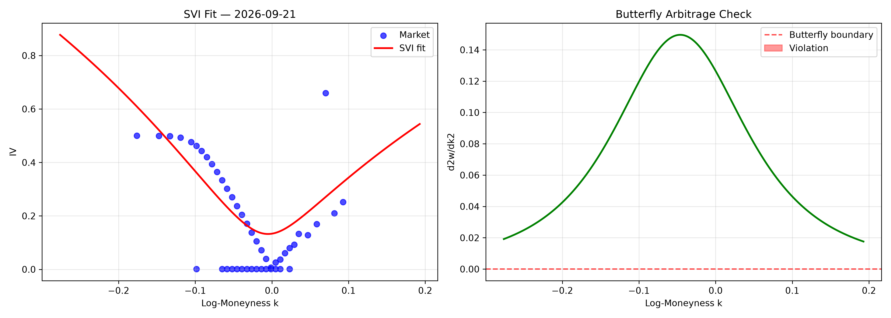
*Butterfly arbitrage (d2w/dk2 >= 0) and calendar spread arbitrage checks.*

### Dashboard Preview
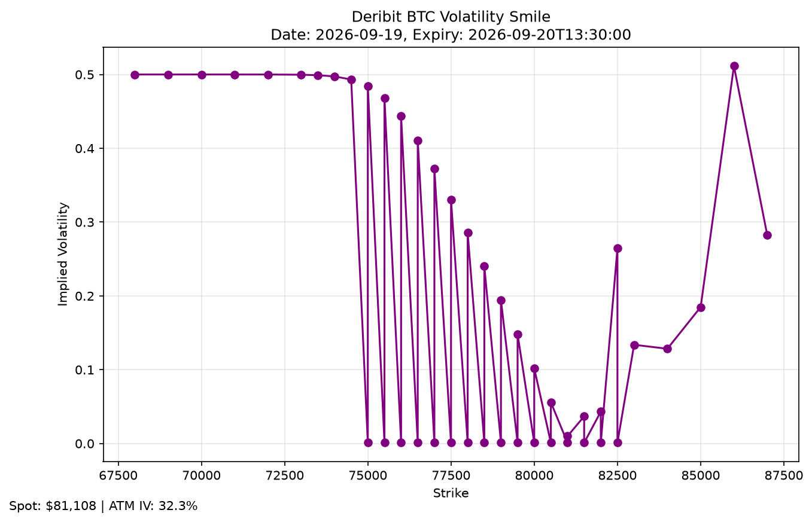
*Preview of the Streamlit dashboard showing IV smile and metrics.*

## Statistical Uncertainty on Win Rates

Small-sample win rates are reported with 95% Wilson confidence intervals:

```
Confidence intervals for backtest win rates:

  BTC in-sample (7 trades, 4 wins)
    Point estimate: 57.1%  |  95% CI: [25.0%, 84.2%]

  BTC walk-forward OOS (2 trades, 0 wins)
    Point estimate: 0.0%  |  95% CI: [0.0%, 65.8%]

  ETH in-sample (11 trades, 4 wins)
    Point estimate: 36.4%  |  95% CI: [15.2%, 64.6%]

  ETH walk-forward OOS (1 trade, 0 wins)
    Point estimate: 0.0%  |  95% CI: [0.0%, 79.3%]
```

**Interpretation:** The 7-trade BTC in-sample win rate of 57% has a 95% CI 
spanning [25.0%, 84.2%]. This is not statistically distinguishable from 50%. 
The strategy requires a larger sample for reliable inference.

## Methodology

### Mathematical Detail

**Black-Scholes Formula** (`src/features/black_scholes.py`):

Call: C = S·N(d1) - K·e^(-rT)·N(d2)
Put:  P = K·e^(-rT)·N(-d2) - S·N(-d1)

where d1 = [ln(S/K) + (r + σ²/2)T] / (σ√T), d2 = d1 - σ√T.

**IV Inversion:** Bisection method over [0.01, 5.0], 50 iterations, tolerance 1e-4.
Chosen over Newton-Raphson for numerical stability on noisy crypto option data.

**Greeks:**
- Delta_call = N(d1), Delta_put = N(d1) - 1
- Gamma = N'(d1) / (S·σ·√T)
- Vega = S·N'(d1)·√T / 100
- Theta = -S·N'(d1)·σ / (2√T) / 365

**SVI Fit** (`src/features/svi.py`):
w(k) = a + b·(ρ·(k-m) + √((k-m)² + σ²))
where w = IV²·T, k = ln(K/S). Constraints: b ≥ 0, |ρ| &lt; 1, σ > 0.

**Risk-free rate:** 0% (crypto convention, 24/7 market).

## Limitations

- **Sample size:** The in-sample backtest has only 7 BTC trades. Wilson 95% CI on the 57% win rate is [25.0%, 84.2%] — the interval includes 50%, so the win rate is not statistically distinguishable from random chance. Walk-forward OOS has only 2 trades on the 60/20 split. This is not statistically significant.

- **Data window:** Deribit's free API caps option history at ~90 days. The option surface covers 84 days (Jun-Sep 2026), one regime only. The DVOL index covers 1 full year. Extending the surface to 2+ years requires Tardis.dev full access (~$700/month).

- **Backtest split sensitivity:** On the original 60/20 walk-forward, OOS returns were BTC -13.72% (n=2) and ETH -3.33% (n=1). On the extended 30/10 split, BTC -7.03% (n=5) and ETH +9.37% (n=6). The strategy is split-sensitive, which is expected for an 84-day window.

- **Slippage assumption:** 1% per side is modeled. At 2x slippage (2% per side), the strategy's edge is materially reduced. See cost sensitivity table in MEMO.md.

- **No second-window validation:** A proper out-of-sample test on a different quarter/regime has not been performed due to data limits. This is documented as the primary barrier to confirming the strategy's edge.

## Repository Structure
